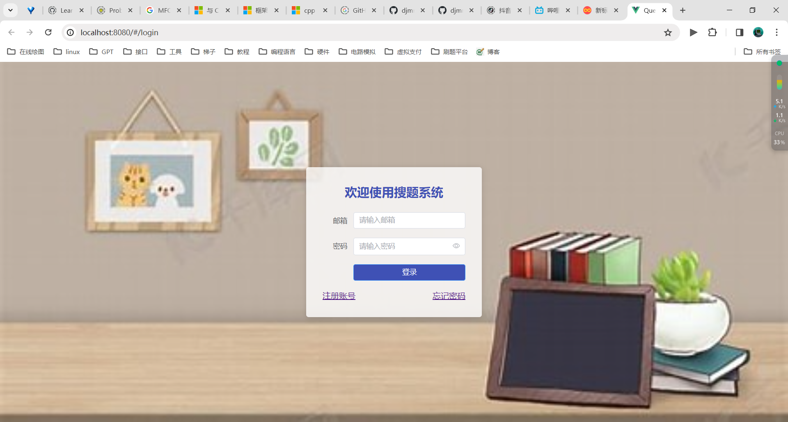
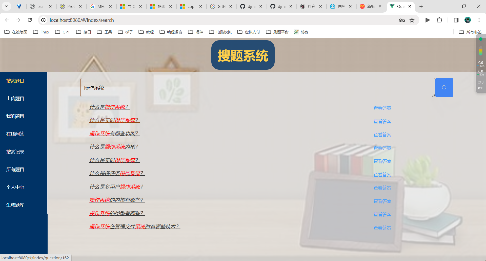

# 搜题系统前端

## 简介
本项目是我课设(搜题系统)的前端部分,  使用vue3框架 elementUI 以及 vuex vue-router 和 axios

## 使用

### 修改代理 和 项目端口

拉取项目下来之后, 一定要记得修改一下代理这个配置(当然,如果不是使用脚手架直接执行了的话, 打包变成html css那些就需要配置web服务器做代理了),在vue.config.js里面

```js
const { defineConfig } = require('@vue/cli-service')


module.exports = defineConfig({
  transpileDependencies: true,
  lintOnSave: false,
  devServer: {
    port: 8080,  // 修改为你想启动的端口
    proxy: {
      '/api': {
        target: 'http://127.0.0.1:8000', // 修改一下这里变成后端服务器地址
        pathRewrite: {
          '^/api': ''  // 如果不写这个,会带着原来的请求路径一起带过去
        }
      }

    }
  }
})
```
### 安装依赖

```shell
npm install
```
### 运行

```shell
npm run serve # 运行项目
npm run build # 构建项目 打包成静态资源
```

## 展示

### 登录界面



### 主界面


